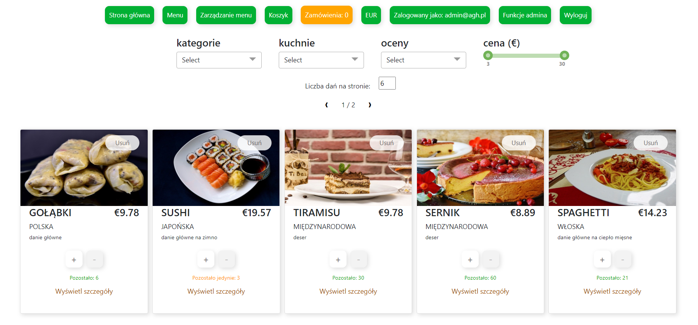
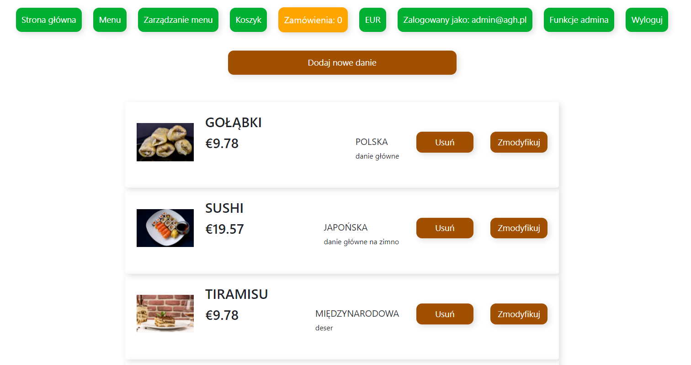
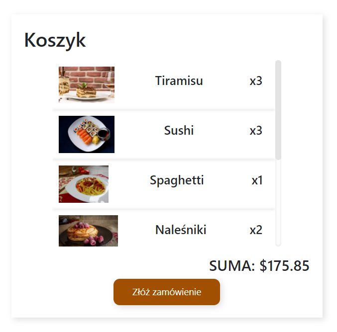
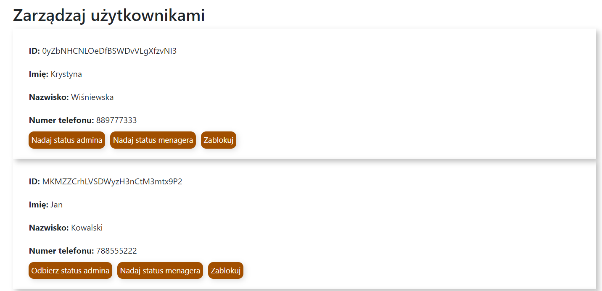

<h1 align="center">Restaurant Website</h1>


## Description
Website of the restaurant with the possibility of ordering food.

## Tech Stack
Angular, CSS3, HTML5, TS, Firebase
<p align="center">


</p>


## Features
There are 3 user modes: client, manager, admin.
### Client Features
- Ordering food
- Filtering dishes (price, type of cuisine, average grade)
- Pagination of the list of dishes on the page
- Possibility to change currencies (USD/EUR)
- Preview of order history
### Manager Features
- Adding new dishes
- Modifying / dishes
### Admin Features
- User banning system
- Setting persistence modes on the site

## Installation
Install dependencies from package.json: ```npm i```<br>
Run ```ng serve``` for a dev server.

## Sample Views
#### Dish List


#### Manage Menu


#### Cart Page


#### Users manager


